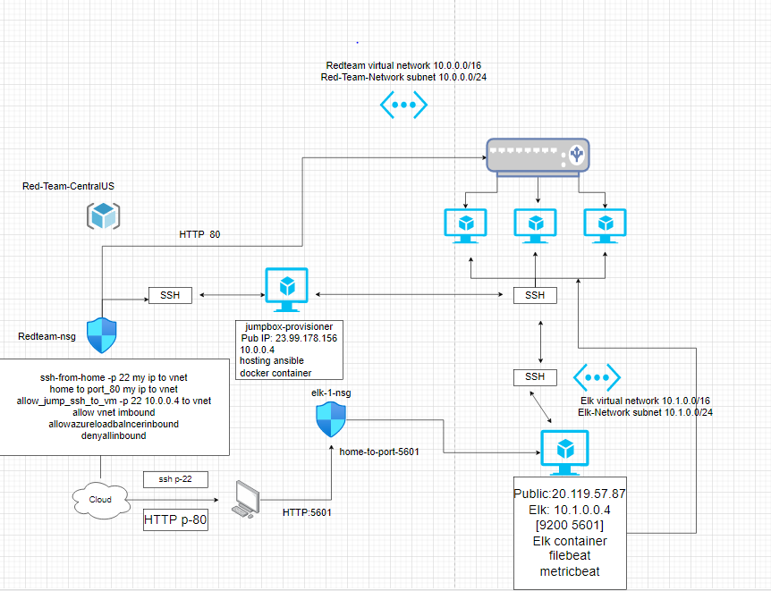
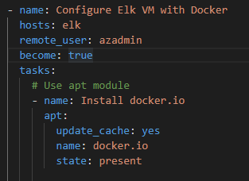
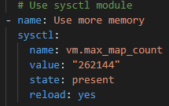
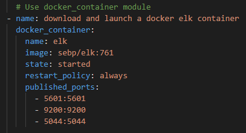
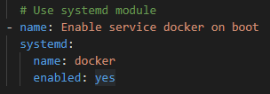

## Automated ELK Stack Deployment

The files in this repository were used to configure the network depicted below.

These files have been tested and used to generate a live ELK deployment on Azure. They can be used to either recreate the entire deployment pictured above. Alternatively, select portions of the yaml file may be used to install only certain pieces of it, such as Filebeat.

This document contains the following details:
- Description of the Topologu
- Access Policies
- ELK Configuration
  - Beats in Use
  - Machines Being Monitored
- How to Use the Ansible Build

### Description of the Topology

The main purpose of this network is to expose a load-balanced and monitored instance of DVWA, the D*mn Vulnerable Web Application.

Load balancing ensures that the application will be highly avaliable in addition to restricting access/distributing access to the network.
- What aspect of security do load balancers protect? What is the advantage of a jump box?_
  - Jump box and load balancers limit access to assets
  - It ensures that high avalability and reliablity by sending requests to server that are online only
  - Load balancers protects against DDOS attacks since it distributes traffic
  - Distributes client requests across multiple servers
  
Integrating an ELK server allows users to easily monitor the vulnerable VMs for changes to the logs and system metrics.
- _TODO: What does Filebeat watch for?_
  - Filebeat monitors log directories or specific log files and forwards them to either Elasticsearch or Logstash

- _TODO: What does Metricbeat record?_
  - Metricbeat records statistics and metrics on the system. An example being how the system health can be monitored by collecting CPU usage.

The configuration details of each machine may be found below.

| Name     | Function | IP Address | Operating System |
|----------|----------|------------|------------------|
| Jump Box | Gateway  | 10.0.0.1   | Linux            |
| web-1 | DVWA Container | 10.0.0.5 | Linux           |
| web-2 | DVWA Container | 10.0.0.6 | Linuz           |
| elk1  | config/monitor | 10.1.0.4 | Linux           |

### Access Policies

The machines on the internal network are not exposed to the public Internet. 

Only the Jump-box machine can accept connections from the Internet. Access to this machine is only allowed from the following IP addresses:

-  My *home public IP* to *Jumpbox provisioner* restricted inbound rule on port 22

Machines within the network can only be accessed by Jumpbox.

- Only the Jump-Box can connect to the ELK VM (Ip: 10.0.0.4)

A summary of the access policies in place can be found in the table below.

| Name     | Publicly Accessible | Allowed IP Addresses |
|----------|---------------------|----------------------|
| Jump Box | Yes             | Admins IP address via SSH    |
| Web-1    | No              | 10.0.0.1-254        |
| Web-2    | No              | 10.0.0.1-254      |
| Web-3    |No               | 10.0.0.1-254      |
|Elk       |No               | 10.0.0.1-254      |

### Elk Configuration

Ansible was used to automate configuration of the ELK machine. No configuration was performed manually, which is advantageous because...

  -Ansible lets multitier applications be deployed via playbooks quickly and easily
  
The playbook implements the following tasks:
- _TODO: In 3-5 bullets, explain the steps of the ELK installation play. E.g., install Docker; download image; etc._
- ...-1. Check if docker.io is present and if it isn't install it as well as install pip and python3

-...-2. Set Memory

- ...3. Download and launch Elk container and define ports

- ...4. Enable service docker on boot

The following screenshot displays the result of running `docker ps` after successfully configuring the ELK instance.

### Target Machines & Beats
This ELK server is configured to monitor the following machines:
- _TODO: List the IP addresses of the machines you are monitoring_
  |Server Name | IP Address |
  |------------|------------|
  | Web-1 |	(10.0.0.5) |
  | Web-2	| (10.0.0.6) |
  | Web-3	| (10.0.0.8) |

We have installed the following Beats on these machines:
- Filebeat
- metricbeat

These Beats allow us to collect the following information from each machine:

- Filebeat is a log data shipper for local files. It monitors log directories and or specific log files and tails the files and sends them to Elasticsearch or Logstash for indexing. Ex: Logs produced form MySQL database supporting the application.

- Metricbeat collects Metrics and statistics on a system. EX: Can monitor CPU usage to check systems health

### Using the Playbook
In order to use the playbook, you will need to have an Ansible control node already configured. Assuming you have such a control node provisioned: 

SSH into the control node and follow the steps below:

- Copy the 'install-elk.yml' file to ansible contianer folder
- Update the hosts file '/etc/ansible/hosts' to include 'Elk server IP address'
- Run the playbook and navigate to '/ect/ansible/http://<VMIP>/:5601' to check if installation worked
  
- _Which file is the playbook? Where do you copy it?
  
  - Copy the "filename-playbook.yml" file to "/etc/ansible/files"
  
- _Which file do you update to make Ansible run the playbook on a specific machine? How do I specify which machine to install the ELK server on versus which to install Filebeat on?_
  
  - The host file defines the host, and the yaml file uses the host's definition to specify where to direct the installation. 
  - You define the host in /etc/ansible/hosts.cfg
  - In the yaml file designate the desired host for the installation
  - Update the .yml file ot include the ELK sever's private IP in line 1106 and 1806
 
- Which URL do you navigate to in order to check that the ELK server is running?
  
  - Elk-public-ip:5601/app/kibana
  
  

